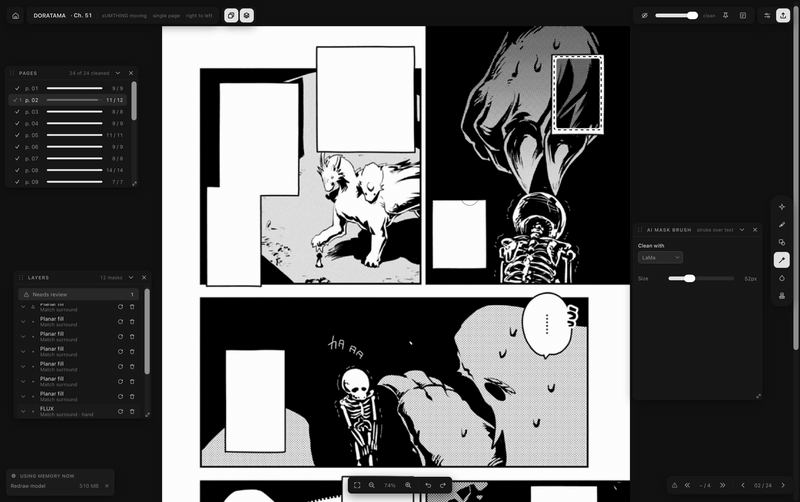

# Manga Cleaner

Remove Japanese text from manga and webtoon pages, locally.

[](https://cleaner.komiq.cc)
[](https://cleaner.komiq.cc)
[](LICENSE)
[](https://ko-fi.com/komiq)

[](https://cleaner.komiq.cc)
[](https://cleaner.komiq.cc)
[](#install)
[](https://v2.tauri.app/)
[](https://svelte.dev/)
[](https://www.rust-lang.org/)
[](https://onnxruntime.ai/)

Manga Cleaner is a standalone desktop app that detects speech bubbles and free text, keeps only the Japanese ones, fits masks at native resolution, and cleans each region with the lightest engine that can do the job. Everything runs on your machine: no account, no upload, no Python. Pixels outside an edited region stay bit-identical to the source, and colour mode, bit depth, embedded ICC profile, and metadata are carried through to export.

## Demo: pick the right engine



[Full quality video](infra/site/public/media/engine-choice.mp4)

The rule is simple: use the lightest engine that does the job. Planar fill handles text on flat paper, denoise fill handles tight masks on noisy or JPEG scans, and manga-LaMa (the default) takes over when there is screentone, halftone, or line art behind the text. The optional FLUX.2 Klein sidecar is reserved for the rare region nothing else can reconstruct, since it needs its own process and several gigabytes of memory. A heavier model on a simple balloon is slower and often worse, because it can hallucinate marks where there was only paper. The video shows a FLUX layer being re-run with manga-LaMa from the layer context menu ("Clean with"), and the Shapes tool with its Mode set per region.

## Install

Download the installer from [cleaner.komiq.cc](https://cleaner.komiq.cc): a `.dmg` for macOS on Apple Silicon, a `-setup.exe` for Windows x64. Both are built and signed by the release workflow, and the app updates itself from cryptographically signed manifests.

Model weights and the runtime are not bundled, which keeps the installer small and respects weight provenance. On first launch the app offers to download the ONNX Runtime (about 32 MB on macOS, about 200 MB on Windows) plus the five required model weights (about 317 MB in total). Anything declined or missed can be fetched later from **Settings › Models**. An optional Japanese text reader (about 460 MB, three files) can be added from the same panel: it recovers roughly 5% of speech balloons that the script gate cannot read and would otherwise go to review uncleaned, and nothing else depends on it. For offline setups, place the verified files in the application's `models/` directory instead.

Intel Macs (`x86_64`) are unsupported: ONNX Runtime 1.28.0 publishes no `osx-x86_64` archive. Linux `x86_64` has a GPU path (the WebGPU plugin, with CUDA flavours for NVIDIA) that has not been executed on real hardware; Linux `aarch64` is best effort and CPU only. Neither is part of the release workflow.

## Features

- Automatic pipeline: detect, gate to Japanese script, fit masks, route to an engine, clean, composite.
- Six manual tools: Auto Clean, Brush, Shapes, AI Mask Brush, Content-Aware Fill, and Clone / Heal.
- Every cleaned region is a layer with its engine, parameters, and timing recorded, re-runnable or deletable with full undo and redo.
- Long-strip webtoon mode with virtual stitching, content-minimum splitting, and bounded-memory streaming across joins.
- Strict export contract: untouched pixels stay bit-identical; 8 and 16-bit, Grayscale, RGB, CMYK, and Indexed all survive.
- Exports PNG, TIFF, and layered PSD per page, with a mask file beside each page on request, or a whole chapter as CBZ.
- In-app model manager with SHA-256 verification and optional Hugging Face token support.
- Hardware acceleration chosen per model, overridable in **Settings › Acceleration**.
- Optional Japanese text reader (manga-ocr) that rescues balloons the script gate cannot classify.
- Keyboard shortcuts for every tool and panel, rebindable in Settings.

## Built with

[Tauri 2](https://v2.tauri.app/) for the shell, [Svelte 5](https://svelte.dev/) for the interface, a pure [Rust](https://www.rust-lang.org/) core for the pipeline, [ONNX Runtime](https://onnxruntime.ai/) for inference, and pure-Rust image I/O throughout. No Python is bundled or required.

Weights live outside this repository and are fetched at setup under their own licences:

| Model | Upstream | Licence |
|---|---|---|
| `comictextdetector.onnx` | [dmMaze/comic-text-detector](https://github.com/dmMaze/comic-text-detector) via [manga-image-translator](https://github.com/zyddnys/manga-image-translator) | GPL-3.0 |
| `lama-manga.onnx` | [mayocream/lama-manga-onnx](https://huggingface.co/mayocream/lama-manga-onnx), finetuned from [advimman/lama](https://github.com/advimman/lama) by [dreMaz](https://huggingface.co/dreMaz/AnimeMangaInpainting) | MIT / Apache-2.0 |
| `image-script-identification-osd_lstm.onnx` | [ogkalu/image-script-identification](https://huggingface.co/ogkalu/image-script-identification) | Apache-2.0 |
| `image-script-identification-osd_labels.json` | [ogkalu/image-script-identification](https://huggingface.co/ogkalu/image-script-identification) | Apache-2.0 |
| `comic-text-and-bubble-detector-detector-v4-s_int8.onnx` | [ogkalu/comic-text-and-bubble-detector](https://huggingface.co/ogkalu/comic-text-and-bubble-detector) | Apache-2.0 |
| `manga-ocr-encoder_model.onnx`, `manga-ocr-decoder_model.onnx`, `manga-ocr-vocab.txt` (optional, 460 MB) | [mayocream/manga-ocr-onnx](https://huggingface.co/mayocream/manga-ocr-onnx), an ONNX export of [kha-white/manga-ocr-base](https://huggingface.co/kha-white/manga-ocr-base) | Apache-2.0 |

## Acceleration

Providers are picked per model from runtime hardware detection and suitability benchmarks, and can be overridden in **Settings › Acceleration** (`auto`, `cpu`, or an explicit provider).

| Platform | Providers | Default | Status |
|---|---|---|---|
| macOS (Apple Silicon) | WebGPU, CoreML, CPU | WebGPU for manga-LaMa, CoreML for the detector, CPU for script ID and balloon | Measured on Apple M-series |
| Windows (x64 / arm64) | DirectML, WebGPU (plugin), CPU | DirectML, which supplies `DFT` for GPU inpainting on NVIDIA, AMD, and Intel; the WebGPU plugin beside it | Designed; unmeasured on real hardware |
| Windows (x64, NVIDIA) | CUDA 12/13, TensorRT, WebGPU (plugin), CPU | Optional flavour; detector on CUDA, and since CUDA lacks `DFT`, LaMa runs on the WebGPU plugin | Optional; needs user-installed CUDA and cuDNN |
| Linux (x64) | WebGPU (plugin), CPU | WebGPU plugin over Vulkan (NVIDIA, AMD, Intel; needs the system Vulkan loader) | Designed; unmeasured on real hardware |
| Linux (x64, NVIDIA) | CUDA 12/13, TensorRT, WebGPU (plugin), CPU | Optional flavour, same terms as Windows | Optional; unmeasured on real hardware |
| Linux (aarch64) | CPU | CPU | Best effort; no CUDA archive or plugin is published |
| macOS (Intel x86_64) | None | N/A | Unsupported under ONNX Runtime 1.28 |

## Build from source

You need a stable [Rust](https://www.rust-lang.org/) toolchain, [Node.js](https://nodejs.org/) 20 or newer, and the [Tauri 2 system dependencies](https://v2.tauri.app/start/prerequisites/) for your platform.

```bash
# 1. Install frontend dependencies
npm install

# 2. Fetch the required ONNX Runtime dynamic library for your platform
scripts/fetch-runtime.sh

# 3. Fetch pinned AI model weights (verified by SHA-256)
scripts/fetch-models.sh

# 4. Run test suites
npm test
cargo test --workspace --exclude spike-strip-memory -- --test-threads=1

# 5. Run the application in development mode
npx tauri dev

# 6. Build the release bundle
npx tauri build
```

`--test-threads=1` is required because concurrent WebGPU session initialisation on macOS can abort the test binary.

## Documentation

- [docs/features.md](docs/features.md): what the app does, tool by tool, with the default shortcuts.
- [docs/findings.md](docs/findings.md): what was measured and learned while building it: hardware, engines, memory, colour, packaging.
- [infra/site/README.md](infra/site/README.md): how [cleaner.komiq.cc](https://cleaner.komiq.cc) serves the download page and the release bucket.

## Status

The frontend is complete and tested (904 frontend tests, 822 Rust tests), and the Rust backend runs a page end to end: detection, bubble classification, script gating, mask fitting, fill, denoise, and LaMa inpainting, compositing, and export with asserted colour fidelity. Virtual stitching and streaming memory boundaries for long-strip webtoons are implemented, though cross-join detection overlap and real-world memory bounds are not yet measured against a large corpus. Windows and Linux runtime and GPU figures remain unmeasured on physical hardware. Known issues in the ladder: manga-LaMa can leave phantom text marks inside bubbles, quality metrics need tuning for outline-dominated regions, and the escalation path wants testing on more screentone fixtures. The optional FLUX.2 Klein sidecar runs over loopback HTTP and is measured on Apple Silicon, but is not yet validated across general manga styles.

## Licence

Manga Cleaner is released under the [GNU General Public License v3.0 only](LICENSE). The licence follows from `comic_text_detector` (from `dmMaze/comic-text-detector` and `manga-image-translator`), which is GPL-3.0 and supplies the per-pixel text segmentation masks that native mask fitting depends on. Complete corresponding source is available at [github.com/k-omiq/manga-cleaner](https://github.com/k-omiq/manga-cleaner) pursuant to GPL-3.0 §6.

With thanks to `comic_text_detector` and `manga-image-translator` (text segmentation), `lama-manga`, `advimman/lama` and `dreMaz` (manga inpainting), `ogkalu` (script identification and bubble detection), `kha-white` and `mayocream` (Japanese text recognition), and to [ONNX Runtime](https://onnxruntime.ai/), [Tauri](https://tauri.app/), and [Svelte](https://svelte.dev/).
