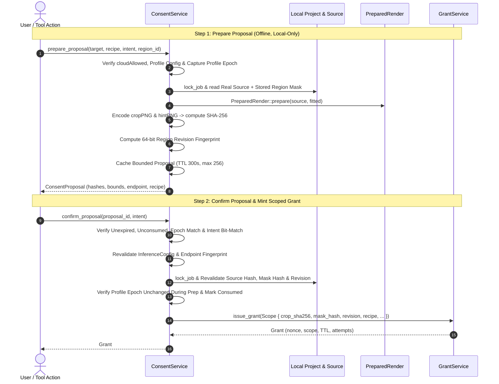

# Manga Cleaner — Backend Authorization Preparation & Consent Service (P3b2)

**Status: P3b2 accepted after two final source re-reviews.** The backend consent and authorization foundation has atomic epoch validation inside grant issuance, a hard bounded grant cache (`MAX_CACHED_GRANTS = 256`), full operation/source/geometry binding against the edit pipeline, and focused concurrency/boundary tests. No consent IPC or paid dispatch is exposed.

**Remaining Milestone Scope:** P3b3 (Frontend Consent Dialogs, i18n copy, and UI integration), P4 (Durable Attempt Journal & Crash Recovery integration), P5–P11 (Remote Network Dispatch, Cloud Provisioning, Chapter Batching, Release Gates). **P3 and P4 are not claimed complete.**

---

## 1. Overview & Architecture

Remote diffusion execution incurs cost and transmits cropped image regions over the network. The intended backend authorization model requires an authoritative, backend-issued, attempt-limited [`Grant`](../src-tauri/src/inference/policy.rs) bound bit-for-bit to real local assets and user intent.

Phase P3b2 establishes the backend-only two-step [`ConsentService`](../src-tauri/src/inference/consent.rs):

---

## 2. Implemented checks and intended invariants

1. **No Caller-Supplied Hashes or Asserted Revisions:**
   - The caller cannot supply digests, geometry assertions, or revisions.
   - All SHA-256 digests (`source_hash`, `mask_hash`, `crop_sha256`, `hint_sha256`) and the 64-bit `revision` fingerprint are derived strictly from disk assets under [`crate::run::lock_job`].

2. **Real Local Source & Geometry Preparation:**
   - `prepare_proposal` loads the actual unedited source page raster and the region's mask from the project manifest (`Job`).
   - Evaluates [`PreparedRender::prepare`](../crates/cleaner-core/src/engines/render.rs) to compute latent-snapped bounds (16-pixel multiples), context padding (`CONTEXT_MIN = 24`, `CONTEXT_MAX = 80`), edge replication, and grayscale hint masks.
   - Encodes exact RGB8 crop PNG and Gray8 hint PNG rasters using the lossless PNG encoder (`cleaner_core::image::encode`) and hashes them.

3. **Deterministic Backend Revision Fingerprinting:**
   - For pipelines without a monotonic integer counter, `compute_region_revision_hash` hashes the source identity, complete serialized patch record, mask bounds/bits, and ink bounds/bits. It retains the full SHA-256 and derives a 64-bit content fingerprint; neither value is a monotonic revision counter.
   - Any modification to source pixels, mask boundaries, or parameters between prepare and confirm immediately fails confirmation with [`ConsentError::RevisionMismatch`].

4. **Bounded Proposal Caching & Zero Full-Page Memory Residency:**
   - `ConsentService` maintains a thread-safe in-memory cache bounded to [`MAX_CACHED_PROPOSALS`] (256 entries).
   - Proposals expire after [`DEFAULT_PROPOSAL_TTL`] (300 seconds).
   - Proposals store only bounded metadata, SHA-256 strings, Rect geometries, and recipes; full page rasters ([`Raster`]) are dropped immediately after crop/hint extraction.

5. **Hard-Bounded Grant Cache & Eviction Policy:**
   - `GrantService` enforces a strict capacity ceiling [`MAX_CACHED_GRANTS`] (256 entries).
   - Grants automatically purge expired records upon issuance and consumption.
   - If capacity is reached, the oldest grant by `issued_at_ms` is evicted.

6. **Profile/Credential Mutation & Grant-Issuance Coordination:**
   - `GrantService` keeps profile mutation epochs and grants under one mutex. Epoch comparison and grant insertion therefore occur in the same critical section.
   - Any modification or deletion of configuration profiles (`write_inference_config`) or credentials (`store_cloud_secret`, `delete_cloud_secret`) invalidates before and after mutation, advancing the epoch, consuming pending proposals, and revoking issued grants. Malformed on-disk public configuration can be replaced only after global invalidation.
   - Proposal preparation captures the epoch before raster work and rechecks it while inserting into the proposal cache. Confirmation passes the captured epoch into atomic grant issuance. Concurrent mutation therefore either invalidates the stored proposal/grant or returns [`ConsentError::ProfileMutated`].
   - Real remote dispatch does not exist in P3b2. P5 must keep grant consumption and submission coordinated rather than treating a successful preflight check as permission that survives a later mutation.

7. **Operation Intent Binding & Replay Prevention:**
   - Proposals bind the exact [`OperationIntent`] (`ApplyTool`, `CreateRegion`, `RerunMask`, `CleanAnyway`), including optional tool parameters and `RerunMask` engine parameters.
   - Confirming with mismatched tool names, parameter differences, engine differences, or different operation verbs fails with [`ConsentError::IntentMismatch`].
   - Confirmation is single-use; subsequent confirmation attempts fail with [`ConsentError::ProposalAlreadyConsumed`].

8. **Pinned Wire Recipe Validation:**
   - Recipes are validated via [`cleaner_core::cloud_wire::validate_recipe`].
   - Enforces ASCII identifiers, strict revision strings, and honesty checks (`native_mask_conditioning = false`).
   - No placeholder or fabricated defaults are permitted.

9. **Zero Network & Zero Model Warming on Prepare:**
   - Proposal preparation is 100% offline. No remote HTTP sockets, DNS lookups, or remote containers are warmed during proposal preparation.

10. **Fail-Closed Region Pipeline Guards:**
    - All existing region edit entrypoints ([`apply_tool`], [`create_region`], [`rerun_mask`], [`clean_anyway`]) fail closed when explicit remote execution targets are provided until real network dispatch is enabled in P5.
    - Rerun of patches with cloud provenance (`record.provenance.cloud.is_some()`) will NOT silently rerun locally; they fail closed with `notice.cloud.unavailable` or `notice.cloud.blocked`.
    - Local Flux and automatic LaMa behavior remain fully preserved.

---

## 3. Unsupported Paths & Future Command Surface

- **Ad-Hoc New Region Drawing:**
  - `prepare_proposal` currently narrows to existing stored regions (`region_id: Some(...)`).
  - Preparing proposals for unsaved new manual region gestures without stored project state is explicitly refused with [`ConsentError::UnsupportedNewRegion`].
- **Future Tauri Commands (Not Yet Exposed):**
  - Once frontend consent modals (P3b3) and durable attempt dispatch (P4/P5) are integrated, dedicated commands (e.g. `prepare_cloud_consent`, `confirm_cloud_consent`) will be registered with capability permissions.
  - To prevent spoofed readiness, no fake or mock Tauri commands are registered in this milestone.

## Stop-point verification

- 69 inference tests pass: `cargo test -p manga-cleaner --lib inference::`.
- 42 region tests pass: `cargo test -p manga-cleaner --lib region::`.
- Strict app-library Clippy passes: `cargo clippy -p manga-cleaner --no-deps --lib -- -D warnings`.
- Both post-fix source re-reviews approve with no P0–P3 findings:
  `/tmp/manga-cloud-p3b2-rereview-vesper.json` and
  `/tmp/manga-cloud-p3b2-rereview-onyx.json`.
- `run::lock_job` remains an in-process lock. Cross-process attempt locking in the journal does not make project writers cross-process safe.
