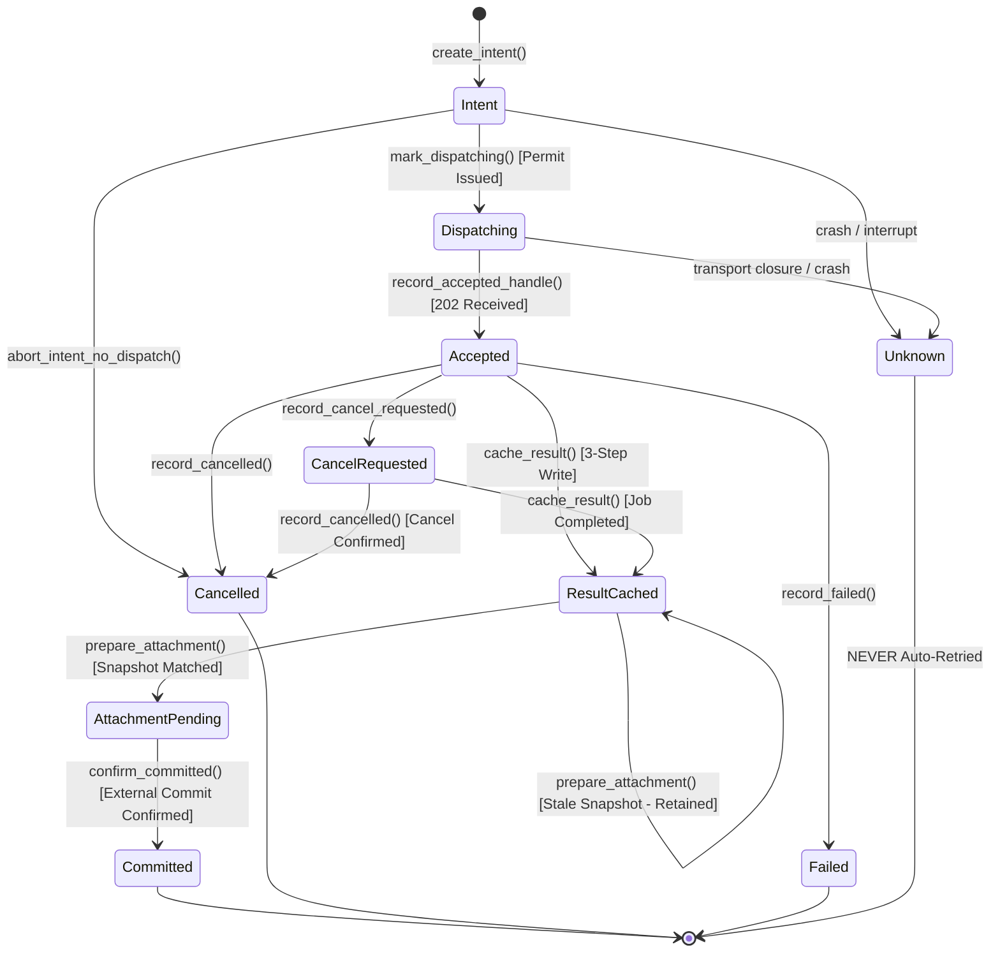

# Manga Cleaner: Cloud Attempt Journal & Validated Result Cache Foundation (P4a)

**Protocol Version:** `1.0.0`
**Milestone Status:** P4a Offline Foundation Delivered (Durable Local State Machine, Cross-Process RAII Locking, Two-Phase Attachment Reconciler, Crash-Discovery Recovery Decider); network dispatch and project attachment were implemented offline later, and have not run live.

---

## 1. System Boundary & Scope

This specification defines the bounded local transactional attempt journal, cross-process exclusive locking RAII, atomic filesystem durability model, and validated PNG result cache implemented in `src-tauri/src/inference/journal.rs`.

> [!IMPORTANT]
> **P4a Foundation Scope:** Remote HTTP dispatching (`POST /mc/v1/jobs`), remote container provisioning, live polling loops, and direct project patch attachment are **absent** from P4a. P4a establishes the billing-safe durable local state machine, OS-level cross-process locking, crash recovery evaluation, and mandatory result decoding gates before any production GPU requests can be issued in subsequent phases (P4b/P5). Later work added them offline.

### Key Architectural Invariants

1. **Durable Intent Before Dispatch:** An attempt's immutable parameters and intent must be persisted and fsynced to disk before any network dispatch permit is issued to the caller.
2. **Durable Dispatching Before Request:** Phase transitions to `Dispatching` and fsyncs to disk before the caller initiates the network HTTP POST request.
3. **Crash During Intent/Dispatching Recovers as Ambiguous Unknown:** If the process terminates, loses power, or crashes while in `Intent` or `Dispatching`, recovery treats the attempt as `Unknown` unless the caller explicitly guaranteed via [`AttemptJournal::abort_intent_no_dispatch`] that no network transmission occurred.
4. **Billing Safety: Unknown NEVER Auto-Retried:** Attempts in the `Unknown` state must never be automatically retried by the system, preventing double-billing on remote GPU infrastructure. `is_auto_retryable()` always returns `false`.
5. **Accepted Handle Persisted Before Polling:** Remote handles returned by `202 Accepted` must be persisted and fsynced to disk before status polling or result fetching commences.
6. **Existing Known Handle Reusable:** Network disconnections, HTTP timeouts, or parsing errors during polling or result downloads preserve the durable remote handle for subsequent resume/retry without re-submitting a new job.
7. **Non-Terminal Cancellation Request:** `CancelRequested` remains non-terminal until remote completion or cancellation is confirmed by authoritative gateway status.
8. **Mandatory Core Decode Validation Before Caching:** Result bytes MUST pass full [`cleaner_core::cloud_decode::decode_result_crop`] validation. The journal rejects caller claims of prior validation.
9. **Three-Step Result Caching & Crash Discovery:** Caching writes validated `result_meta.json` first, `result.png` second, and updates `journal.json` to `ResultCached` third. Crash recovery from `Accepted` or `CancelRequested` reconciles pre-existing metadata and PNG via full decode verification, restoring `ResultCached` if valid, and retaining corrupted files safely for user inspection without auto-inference.
10. **Two-Phase Project Attachment Reconciler:** Persists `AttachmentPending` with stable `patch_id` and result identity before external project commit. Recovery verifies project state by the same `patch_id` and never blindly attaches again.
11. **Exact Snapshot Compare & Stale Attachment Rejection:** Attachment verifies exact matching across source image hash, region ID, region revision, crop hash, and hint mask hash (`ProjectRegionSnapshot`). If any field drifted, attachment fails closed (`StaleAttachment`), but the validated result is retained in the cache for user review and recovery.
12. **Duplicate Commit Prevention:** Commits record the patch identity, ensuring idempotent re-attachment and preventing duplicate project commits.
13. **Safe Opaque Identifiers:** Identifiers are restricted to bounded ASCII alphanumeric, hyphen, and underscore characters (`[a-zA-Z0-9_-]`, 1..=128 chars) to eliminate directory traversal.
14. **Zero Secrets in Journal Storage:** The journal stores only public identifiers, hashes, and recipe parameters. No credentials, tokens, or grant nonces are ever persisted.
15. **Cross-Process Exclusive RAII Locking:** Uses OS-managed kernel file locks (`flock` on Unix, `LockFile` on Windows). Locks are released automatically on process crash without relying on stale PID guessing. Unsupported OS platforms fail closed.
16. **Guard Root Binding:** Lock guards carry and compare canonical journal roots; foreign guards from different root directories fail closed.
17. **Durability Ordering:** In-memory state never advances if disk persistence fails.
18. **Explicit Windows Durability Limitation:** This implementation does not flush directory handles on Windows; power-loss durability there remains unverified.

---

## 2. Cross-Process Exclusive Locking & Dependency Report

### 2.1 OS-Managed Kernel Locking vs Stale PID Guessing

Traditional PID file locking schemes suffer from critical edge cases:
- Process crashes leave stale PID files on disk.
- Operating system PID recycling can cause an unrelated process to appear to hold the lock.
- Reading and verifying PID files is race-prone across processes.

The journal implements kernel-managed file locking via [`AttemptLockGuard`]:
- **Unix (`cfg(unix)`):** Invokes `libc::flock(fd, libc::LOCK_EX | libc::LOCK_NB)`.
- **Windows (`cfg(windows)`):** Invokes `windows_sys::Win32::Storage::FileSystem::LockFile(handle, 0, 0, 1, 0)`.
- **Automatic Kernel Cleanup:** When a process terminates (normally or abnormally via SIGKILL, crash, or panic), the operating system kernel automatically closes all open file descriptors and handles, immediately releasing the lock. No stale lock cleanup logic is required.
- **Rust MSRV 1.82 Compliance:** Avoids newer unstable `std::fs::File::lock` APIs.
- **Foreign Guard Prevention:** Guards store the canonical path of the issuing journal root. Any locked mutation or read checks `guard.canonical_root == self.canonical_root`, preventing cross-journal corruption.

### 2.2 Dependencies and integration

The module is registered and uses existing `libc` / `windows-sys` dependencies.
No `fs2` dependency is required. Tests run on macOS; Windows locking and
power-loss behavior remain unverified.


## 3. Filesystem Layout & Atomic Durability Semantics

### 3.1 Directory Structure

The journal root resides in an application-owned directory (e.g. `<app_data_dir>/cloud_journal/`):

```text
<journal_root>/
└── attempts/
    └── <attempt_id>/
        ├── lock               # Zero-byte file for OS-level exclusive locking
        ├── journal.json       # Atomically written state machine record
        ├── result_meta.json   # Step 1: validated result metadata
        └── result.png         # Step 2: validated output crop PNG
```

### 3.2 Atomic Write & Fsync Ordering

All mutations to `journal.json`, `result_meta.json`, and `result.png` execute via `atomic_write_file`:
1. Generate a unique sibling temporary file in the same parent directory: `.<name>.tmp.<pid>_<nanos>_<counter>`.
2. Open with `create_new(true)` to guarantee no collision.
3. Write payload bytes and invoke `file.sync_all()`.
4. Close/drop the file handle before renaming (mandatory for Windows compatibility).
5. Atomically rename the temporary file over the target path (`fs::rename`).
6. **Unix Parent Directory Sync:** On Unix platforms, open the parent directory and invoke `dir.sync_all()`, propagating any I/O errors.
7. **Explicit Windows Durability Limitation:** This implementation does not flush Windows directory handles. Windows power-loss and installed-package tests remain required; no NTFS durability guarantee is claimed.

### 3.3 Streaming Reads & Denial of Unknown Fields

- Reading `journal.json` and `result_meta.json` uses streaming reads bounded at `MAX_JOURNAL_JSON_BYTES + 1` (`take(MAX_JOURNAL_JSON_BYTES + 1)`), rejecting oversized payloads during stream consumption rather than relying on file metadata alone.
- `AttemptRecord`, `AttemptPhase`, and `ProjectRegionSnapshot` enforce `#[serde(deny_unknown_fields)]`.
- `get_record` executes full semantic validation on schema version, IDs, hashes, recipe metadata, dimensions, canonical request digest, and phase constraints.

---

## 4. State Machine & Lifecycle Transitions

### 4.1 Lifecycle State Machine



### 4.2 Phase Transitions Table

| Current Phase | Action / Method | Target Phase | Invariants & Requirements |
|---|---|---|---|
| *None* | `create_intent` | `Intent` | Validates IDs, bounds, dimensions (`LATENT_STRIDE=16`), and `MC-REQ-V1` digest. Acquires exclusive lock. Persisted before permit. |
| `Intent` | `mark_dispatching` | `Dispatching` | Fsyncs to disk before returning `DispatchPermit`. In-memory state does not advance if disk write fails. |
| `Intent` | `abort_intent_no_dispatch` | `Cancelled` | Caller explicitly guarantees no HTTP request was sent. Recovers as terminal cancelled. |
| `Intent` | *Crash / Restart* | `Unknown` | Ambiguous whether dispatch began; marked `Unknown`. Never auto-retried. |
| `Dispatching` | `record_accepted_handle` | `Accepted` | Stores remote `handle` (e.g. `handle-test-modal-999`). Must be durable before polling starts. |
| `Dispatching` | `record_dispatch_transport_error` | `Unknown` | Network disconnects before `202 Accepted`. Status ambiguous; never auto-retried. |
| `Dispatching` | *Crash / Restart* | `Unknown` | Process interrupted while request was in-flight. Remote execution unknown; never auto-retried. |
| `Accepted` | `record_cancel_requested` | `CancelRequested` | Non-terminal request. Allows subsequent completion or cancellation. |
| `Accepted` / `CancelRequested` | `cache_result` | `ResultCached` | 3-step write: writes `result_meta.json`, then `result.png`, then updates `journal.json` to `ResultCached`. Mandatory `decode_result_crop` validation. |
| `Accepted` / `CancelRequested` | `record_cancelled` | `Cancelled` | Authoritative remote gateway confirmed cancellation. Terminal. |
| `Accepted` / `CancelRequested` | `record_failed` | `Failed` | Authoritative remote gateway reported worker failure. Non-retryable. |
| `ResultCached` | `prepare_attachment` | `AttachmentPending` | Verifies full snapshot (`source_image_hash`, `region_id`, `region_revision`, `crop_sha256`, `hint_sha256`). Persists stable `patch_id` and result identity before external project commit. |
| `ResultCached` | `prepare_attachment` | `ResultCached` | Snapshot mismatch. Returns `StaleAttachment` error, but **retains cached result** for recovery/inspection. |
| `AttachmentPending` | `confirm_committed` | `Committed` | Confirms receipt from external project commit. Commits record `patch_id` to guarantee idempotent commits. |

### 4.3 Recovery Decision Tree (`recover_attempt`)

Upon application restart, the journal inspects uncommitted attempts and returns explicit recovery decisions:

- **`Intent` or `Dispatching`:** Transitions to `Unknown` and returns `RecoveryDecision::AmbiguousUnknown`. **NEVER auto-retried.**
- **`Accepted` or `CancelRequested` (with result files on disk):** Discovers `result_meta.json` and `result.png`. Runs full core `decode_result_crop` validation. If valid, restores `ResultCached` and returns `RecoveryDecision::ResultCachedReadyForAttach`. If corrupt, retains files for inspection and returns `RecoveryDecision::CorruptedResultRetainedForInspection`.
- **`Accepted` (no result files):** Returns `RecoveryDecision::ResumePolling { handle }`. Reuses existing known handle without re-submitting.
- **`CancelRequested` (no result files):** Returns `RecoveryDecision::ResumeCancelPolling { handle }`. Resumes polling to observe completion or cancellation.
- **`ResultCached`:** Returns `RecoveryDecision::ResultCachedReadyForAttach { handle, result_digest }`. Reuses locally validated output.
- **`AttachmentPending`:** Returns `RecoveryDecision::AttachmentPendingVerification { patch_id, result_digest }`. Caller must query the local project database by `patch_id` to verify if commit completed before crash, preventing duplicate project attachment.
- **`Committed`:** Returns `RecoveryDecision::AlreadyCommitted { patch_id }`. No action required.
- **`Cancelled` or `Failed`:** Returns `RecoveryDecision::Terminal { message }`. Never auto-retried.

---

## 5. Verification & Test Suite

The module includes 13 comprehensive unit tests exercising real filesystem paths, locks, and PNG decoding:

1. `test_safe_opaque_id_validation`: Path traversal sequences, null bytes, whitespace, and empty/oversized IDs fail closed.
2. `test_foreign_guard_rejected`: Guard acquired from journal A used against journal B fails closed with `ForeignGuard`.
3. `test_ambiguous_accept_disconnect_counted`: Transport drop during dispatch transitions to `Unknown` and enforces zero auto-retry.
4. `test_abort_intent_explicit_no_dispatch`: Explicit pre-dispatch abort recovers as terminal cancelled, not ambiguous unknown.
5. `test_restart_known_handle_and_result_reuse`: Crash recovery resumes polling with the existing known handle, and subsequently reuses cached validated PNGs across restarts.
6. `test_invalid_lifecycle_transitions`: Illegal transitions (premature accept, caching without acceptance) fail closed.
7. `test_disk_write_failure_injection_preserves_in_memory_state`: Simulated write failures preserve disk and in-memory state in `Intent`.
8. `test_concurrent_ownership_two_lock_descriptors`: Cross-process mutual exclusion verifies second descriptor fails with `AttemptLocked` and succeeds upon guard drop.
9. `test_cancellation_ack_nonterminal`: Proves non-terminal state allows subsequent completed or cancelled resolution.
10. `test_two_phase_project_commit_and_recovery`: Proves `AttachmentPending` persistence before commit, restart recovery requiring project check, and idempotent commit receipt.
11. `test_wrong_source_same_revision_stale_attach`: Snapshot with matching revision but mismatched image hash fails closed with `StaleAttachment` and retains cached output.
12. `test_corrupt_cache_read_rejected`: Tampered cached PNG bytes fail hash and decode checks in `read_cached_png`.
13. `test_crash_between_result_write_and_journal_recovers`: Simulates process crash after metadata and PNG write; recovery discovers files, decodes them, and restores `ResultCached`.
14. `test_no_auto_retry_accepted_failure`: Verifies that failures are strictly non-retryable and `is_auto_retryable()` returns false.

### Orchestrator corrections

New directory entries and parent directories are synced on Unix, with errors
propagated. Cache reads use a 64 MiB host ceiling independently of advertised
limits. Resuming the same pending patch rechecks all snapshot fields and cached
pixels. Transition diagnostics are static strings; raw HTTP/body/store errors
are not accepted for persistence. The external project writer must verify the
stable patch ID before calling `confirm_committed`; this module does not perform
or certify an external project commit. New-region and cross-project ownership
integration remains P4b work.
